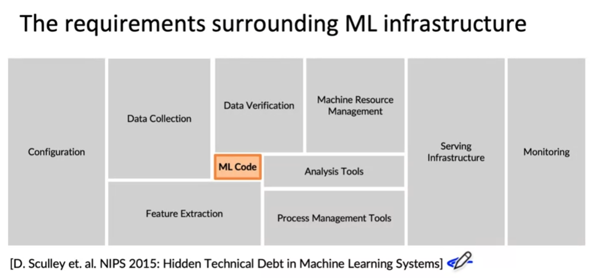

Usually after training a learning algorithm that does well on the test set, there will still be many things to do to make the algorithm be applied in production, due to the **concept drift or data drift**. It is important to make sure that our machine-learning model don't just do well on the hold-out test set, but actually create value in a practical production deployment environment. **It is all about "practice".** 

What is all the other stuff besides the ML codes?

There many components beyond the ML codes, especially components for managing the data, such as data collection, data verification, feature extraction
## Steps of an ML Project
