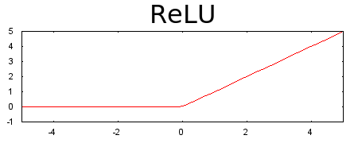

Most problems(classification, prediction or something else) are **nonlinear**. It means that we can't accurately predict a label with a model of the form $b+w_1x_1+w_2x_2$ in other words. We looked at [feature crosses](https://developers.google.com/machine-learning/crash-course/feature-crosses/video-lecture) as one possible approach to modeling nonlinear problems.  
To see how neural networks might help with nonlinear problems, let's represent a linear model as a graph:
```mermaid
graph BT
    1(( )) --> 4(( ))
    2(( )) --> 4
    3(( )) --> 4
    style 4 fill:#f00
    style 1 fill:#ff0
    style 2 fill:#ff0
    style 3 fill:#ff0
```
Each yellow circle represents an input feature, and the red circle represents the weighted sum of the inputs.
### Hidden Layers
In the model represent by the following graph, we've added a **hidden layer** of intermediary values. Each green node in the hidden layer is a weighted sum of the yellow input node values. The output is a weighted sum of the green nodes.
```mermaid
graph BT
    1(( )) --> 4(( )) & 5(( )) & 6(( ))
    2(( )) --> 4 & 5 & 6
    3(( )) --> 4 & 5 & 6

    4 & 5 & 6 --> 7(( ))

    style 4 fill:#291
    style 5 fill:#291
    style 6 fill:#291

    style 1 fill:#ff0
    style 2 fill:#ff0
    style 3 fill:#ff0

    style 7 fill:#f00
```
But it still a linear model.
### Activation Functions
To model a nonlinear problem, we can directly introduce a nonlinearity. We can pipe each hidden layer node through a nonlinear function. 
In the model represented by the following graph, the value of each node in Hidden Layer 1 is transformed by a nonlinear function before being passed on to the weighted sums of the next layer. This nonlinear function is called the activation function.
```mermaid
graph BT
    1(( )) --> 4(( )) & 5(( )) & 6(( ))
    2(( )) --> 4 & 5 & 6
    3(( )) --> 4 & 5 & 6

    4 --> 7(( ))
    5 --> 8(( ))
    6 --> 9(( ))

    7 & 8 & 9--> 10(( ))
    7 & 8 & 9--> 11(( ))
    7 & 8 & 9--> 12(( ))

    10 & 11 & 12 --> 13(( ))

    style 4 fill:#291
    style 5 fill:#291
    style 6 fill:#291
    style 10 fill:#291
    style 11 fill:#291
    style 12 fill:#291

    style 1 fill:#ff0
    style 2 fill:#ff0
    style 3 fill:#ff0

    style 7 fill:#0AF
    style 8 fill:#0AF
    style 9 fill:#0AF

    style 13 fill:#f00
```
### Common Activation Functions
The following sigmoid activation function converts the weighted sum to a value between 0 and 1.
$$F(x)=\frac{1}{1+e^{-x}}$$

The following **rectified linear unit** activation function (or **ReLU**, for short) often works a little better than a smooth function like the sigmoid, while also being significantly easier to compute.
$$F(x)=max(0,x)$$

In fact, any mathematical function can serve as an activation function. Suppose that $\sigma$ represents our activation function (Relu, Sigmoid, or whatever). Consequently, the value of a node in the network is given by the following formula:
$$\sigma(w\cdot x+b)$$